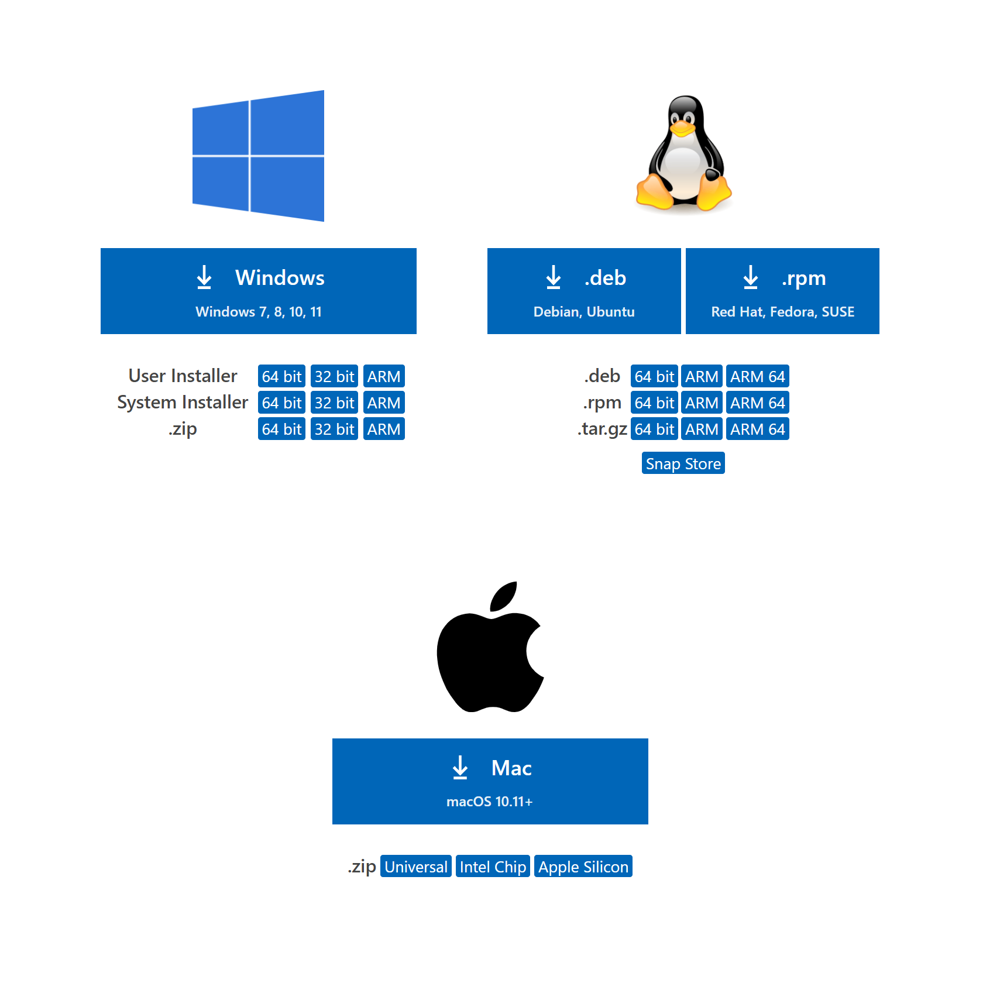
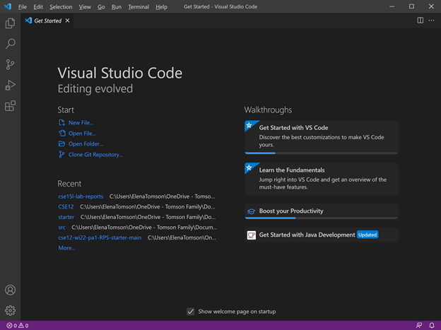
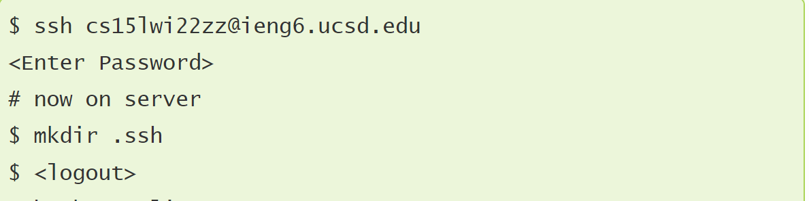

Elena Tomson
---
Lab Report #1 Week 2

# Installing VScode
If you do not have VSCode already installed, install the proper verion for your computer [here](https://code.visualstudio.com/Download)



Once you have VSCode, open it.


# Remotely Connecting

First, [Install-SSH](https://docs.microsoft.com/en-us/windows-server/administration/openssh/openssh_install_firstuse)

To remotely connect, type ssh and your username and your password when prompted.

*Note*: You will need to input your password whenever prompted until we set up the ssh key. 


Then you should see something resembling this


Congrats! you are now remotely on the ieng6 server at UCSD. Your computer is now a client to ieng6.
# Trying Some Commands

From here, you can input an array of [commands](https://commonmark.org/help/) to the server: 


For example, "cd ~" goes to home directory, then ls lists the files there


# Moving Files with scp

Similarly to signing in, to copy a file from the client to the server, input the command "scp" followed by the file to be copied and then your username followed by :~/


When I did this, the file copied over would print information about it's location when run.


The first run is on the linux server and the second is on the windows client.

# Setting an SSH Key

First, you need to run "ssh-keygen" on the client.
Then enter the file name you want for your key, then leave the passphrase empty.

Then you need to make an ssh directory on the server.

Then copy the public key to the server using scp like 

"scp /Users/joe/.ssh/id_rsa.pub cs15lwi22@ieng6.ucsd.edu:~/.ssh/authorized_keys"

but with your .ssh directory and public key as well as your username.

The location of the public file was visible when you made the keys, make sure this is where you are copying from or it will not work.


# Optimizing Remote Running

To copy and run changes on the server quickly, type the scp and ssh commands for copying and then compiling and running the file, then use arrows to get up to them to rerun the program.

The 2 commands can placed in succession, surrounded by one set of ""s and seperated by a ; to make one command to be used for the following.

Keystrokes for first run(assuming you have the command availiable somewhere onscreen i.e. a note): **7**
```
highlight command
ctrl+C -- copy
click into terminal
ctrl+V -- paste into terminal
enter
```
Keystrokes in terminal for subsequent runs: **2**
``` 
up arrow -- to the compile and run command
enter -- compiles and runs code

```


