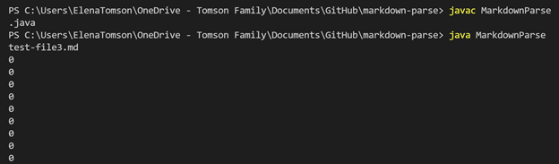

# Lab Report 2 -- Week 4
## Welcome!
Welcome to the second lab report, here we shall begin to debug.

## The first problem - images (part 1) 

* Problem file [here](https://github.com/Monip1/markdown-parse/blob/1b9b5c7d1c9b0cf09d9f73caa23300750fa6e50a/test-file2.md) has an image.
* Here is the symptom 
* An image anywhere in the file would print as a link because it has the same basic "" outline as a link does. The parse did not check for the "!" before an image to discount it. One way to know that there will not be a "!" before the "[" is if the "[" is at index 0, which is what this update checks for.  
## The second problem - having text after the last link (also images part 2)

* Problem file [here](https://github.com/Monip1/markdown-parse/blob/1b9b5c7d1c9b0cf09d9f73caa23300750fa6e50a/test-file3.md) has characters beyond the final ")" or link / image.
* Here is the symptom 
* A file with anything following the last link or image would cause the program to become stuck in an infinite loop because the index of any ")" + 1 is never greater than the file length. Since there was a printout of curIndex in the loop, it continuously printed zeros This update breaks the while loop if any of the elements are not found in the rest of the file at any point. This update also completes the recognition of images by the "!" preceeding them and does not print them.
## The third problem - extra brackets 

* Problem file [here](https://github.com/Monip1/markdown-parse/blob/1b9b5c7d1c9b0cf09d9f73caa23300750fa6e50a/test-file4.md) has extra "[]"s in it.
* Here is the symptom 
* If any extra "[" without a preceeding "!" was located after the last link but before an image, the program printed out the link of that next image. This was due to it checking the extra "[" for the "!" instead of the images "[", not finding the "!" and printing out the link as it saw fit.
This was partially fixed by checking once if the "]" found is one indice before the "(" and finding the next set of "[]"s if it was not. This makes it account for one extra bracket or set, but not multiple: that will be resolved later.