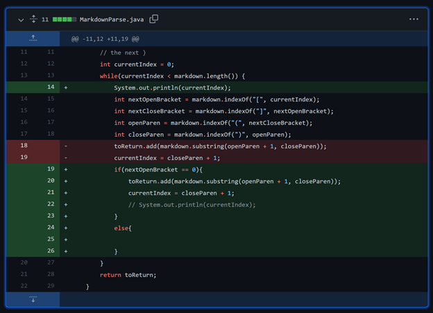
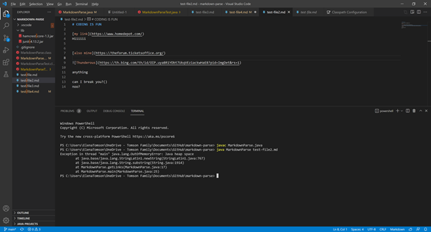
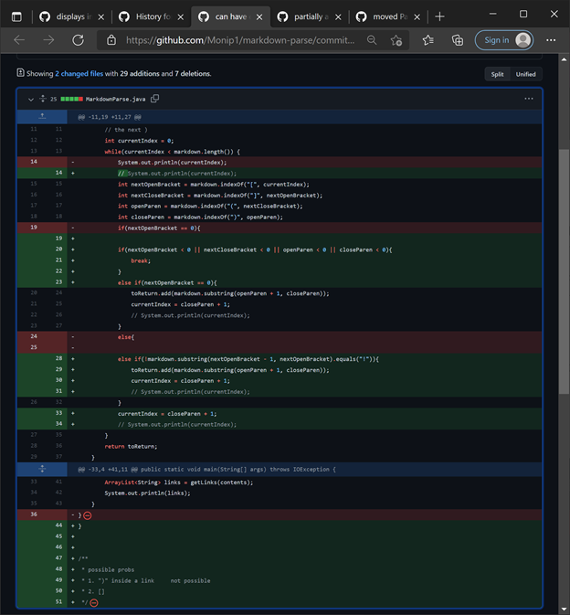
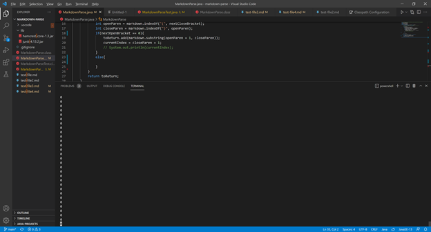
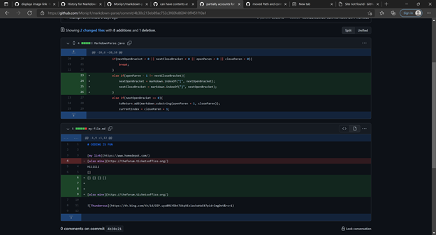
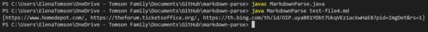

Pick three code changes that your group worked on in labs 3 and 4 in order to fix a bug; these should be stored as commits on someone’s repository. Fork the repository so you have your own copy with all the work your group did if you haven’t already.

For each of the three code changes:

1. 
* 
* [Has Extra Characters](https://github.com/Monip1/markdown-parse/blob/1b9b5c7d1c9b0cf09d9f73caa23300750fa6e50a/test-file2.md)
* 
* Anything at the end of the file caused it to never finish running and print out the links because it got stuck in a while loop forever. Since the last character was not a ")", 
2. 
* 
* [Has Image](https://github.com/Monip1/markdown-parse/blob/1b9b5c7d1c9b0cf09d9f73caa23300750fa6e50a/test-file3.md)
* 
* Images were printing as links. This was because the only difference between a link and image is "!" preceeding "["
3. * 
* [HasBrackets](https://github.com/Monip1/markdown-parse/blob/1b9b5c7d1c9b0cf09d9f73caa23300750fa6e50a/test-file4.md)
* 
* The extra "[" did not have a "!" before it, so the program didn't see it as an image, but a link, and printed it.