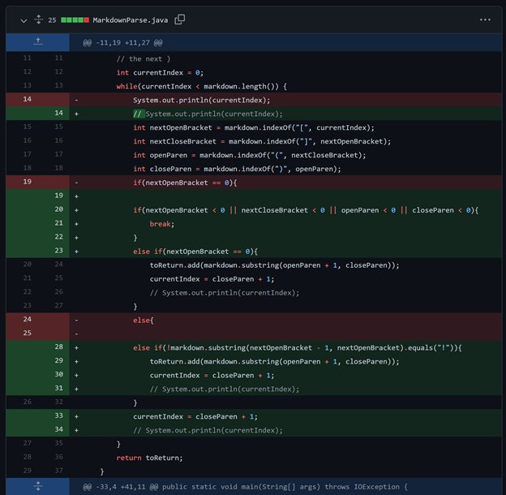
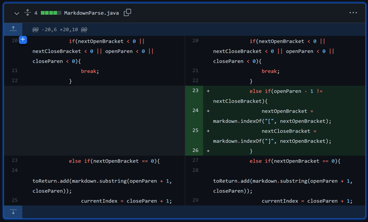

Pick three code changes that your group worked on in labs 3 and 4 in order to fix a bug; these should be stored as commits on someone’s repository. Fork the repository so you have your own copy with all the work your group did if you haven’t already.

For each of the three code changes:

1. 
* 
* [HasImage](2)
* 
* Anything at the end of the file caused it to never finish running and print out the links because it got stuck in a while loop forever. Since the last character was not a ")", 
2. 
* 
* [HasBracket](3)
* 
* Write 2-3 sentences describing the relationship between the bug, the symptom, and the failure-inducing input.
3. * 
* Link to the test file for a failure-inducing input that prompted you to make that change
* 
* Write 2-3 sentences describing the relationship between the bug, the symptom, and the failure-inducing input.