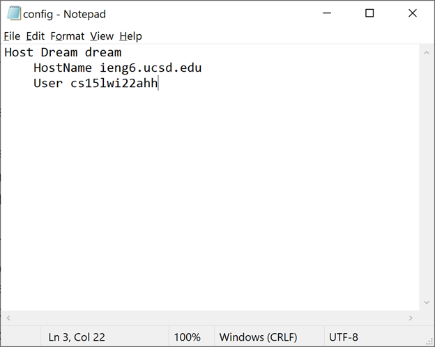
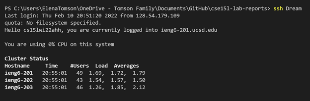
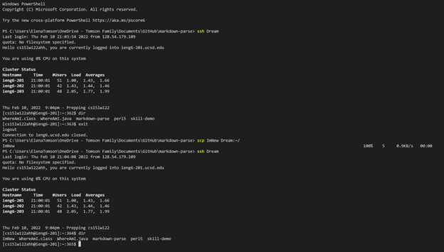

# Week 6 Lab Report

I went to the .ssh directory and created a file called config.
Then I opened it in notepad and pasted the given code and changed the nickname.


Then I was able to successfully log into ieng6 using 
```
> ssh Dream
```


Then I was also able to successfully copy a new file to ieng6 using 
```
> scp ImNew Dream:~/
```

You can see the file was not there prior to the scp but was present after.
