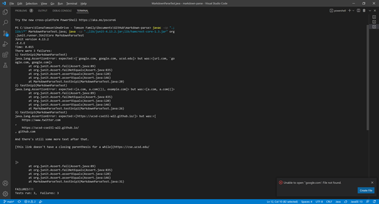
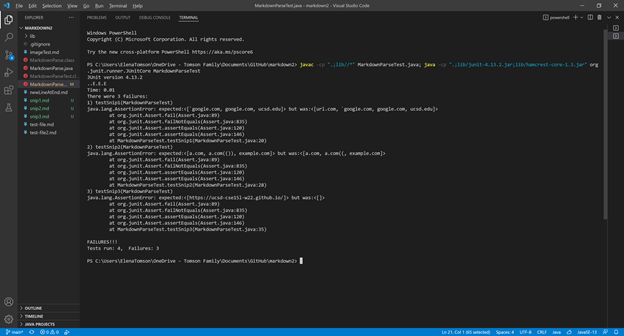

[Back](https://monip1.github.io/cse15l-lab-reports/)
---
# Week 8 lab report! YAYYYY!

[Elena Markdown](https://github.com/Monip1/markdown-parse)

[Achuth Markdown](https://github.com/AchuthKrishna/markdown-parse)

Referencing VSCode's preview for correct links:
---
 snippet 1 should produce
```
[`google.com, google.com, ucsd.edu]
```
2 should produce 
```
[a.com, a.com(()), example.com]
```
3 should produce
```
[https://ucsd-cse15l-w22.github.io/]
```
Here are my tests failing.

Here's Achuth's tests failing.


## Question Responses:

1. To correct snip one, I would need to ignore and brackets that are in between two " ` "s. If there is a backtick before my next "[", I should find the second backtick, which would be the closer, and start looking for brackets starting there. This would be a for loop until there are no more backticks before the bracket. Then for the cases with ticks in the name, I would look for is there is an even number of ticks in between the []s and look for a close bracket being between the last tick and the "(" to set as the nextCloseBracket. Probably more than 10 lines.

2. To correct snip 2, we could use the a MyStack to look for the close parenthesis to match the opening one. If we added each next bracket (or parenthesis if in the url) to the stack and then pop the pair off when it's a close bracket, until the stack is empty, in which case the last 2 popped were the right pair. Might be doable in 10 lines in markdown but uses another file.

3. Probably the simplest solution. Could check for newlines in the url, discount it if there are any, and set current index to the open parenthesis. This way if there's a link inside the broken link that is correct, parse will still find it.