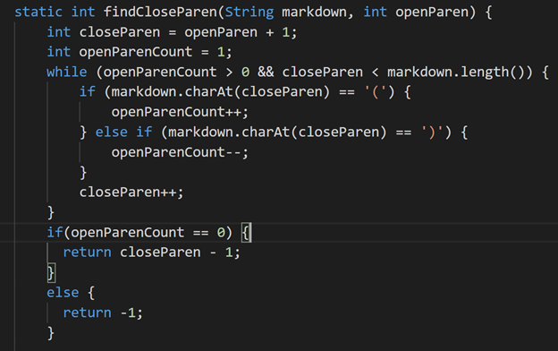

[Back](https://monip1.github.io/cse15l-lab-reports/)
---
Elena Tomson
---
Lab Report #5 Week 10

I used diff to differentiate the files. 

When we look at the results file from class we find 

List of differences in numbered .md files --
--- 
From file 494:
line 878 has `[\(foo\)]`

From file 495:
line 880 has `[foo(and(bar))]`

From file 496:
line 882 has `[]`

From file 497:
line 884 has `[]`

From file 498:
line 886 has `[]`

My results file showed

From file 494:
line 878 has `[\(foo\]`

From file 495:
line 880 has `[foo(and(bar]`

From file 496:
line 882 has `[foo(and(bar]`

From file 497:
line 884 has `[foo\(and\(bar\]`

From file 498:
line 886 has `[<foo(and(bar]`

The actual outputs are
stacked 494 as the bottom error, 495 as middle, and the equal 497 amd 498 link on top.
496 has no link

So
------------------------------------- Joe's code ------------- myCode --------------- Actual

From file 494: 
line 878 has---`[\(foo\)]`--------------`[\(foo\]`---------------`[(foo)]`

From file 495: 
line 880 has---`[foo(and(bar))]`---`[foo(and(bar]`------`[foo(and(bar))]`

From file 496: 
line 882 has---`[]`---------------------------`[foo(and(bar]`------`[]`

From file 497: 
line 884 has---`[]`---------------------------`[foo\(and\(bar\]`---`[foo(and(bar)]`

From file 498: 
line 886 has---`[]`---------------------------`[<foo(and(bar]`-----`[foo(and(bar)]`

For my 2 files I choose file 494 and 496.

Int file 494, both the lab code and my own code were incorrect.

One fix is that noth codes are not accounting for slashes.

 Neither file accounts for the backslashes, so that could be a method added to both. A helper method could be added to getLinks to remove and remove all backslash characters from the link. There may be a java command to do this but it could also be a loop searching for and removing them from the string until the end of the string is reached.

The second file is 496. For this, my code was incorrect but the lab code was.

This method is not accurately tracking the parantheses and if it used a Stack, it could better keep count of parentheses within the link. If we added the open parentheses and then popped off the top whenever there was a closed parantheses, it will have found the correct closed parentheses when it would pop an empty stack.

